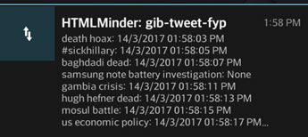

# [fyp_tweet_harvester](https://github.com/nossbigg/fyp_tweet_harvester) 
Source code for tweet harvester for **A Study on Rumour Detection on Online Social Networks** final year research project.

## Key Features
* Automated 24/7 tweet harvester
* Live Worker Information via Notifications

* JSON-based configuration for easy configuration of software
* Collection and compilation of tweets into user-configurable folder names
* Gzip compression for tweet archives for reduction of disk usage (up to 90%+ space savings)
* Duplicate tweet reduction and network bandwidth optimisations via persistence of last collected tweet ID

## Related Projects
* [fyp_py](https://github.com/nossbigg/fyp_py): Repository for main analysis codes for research project
* [fyp_py_web](https://github.com/nossbigg/fyp_py_web): Web front-end for experiment results visualization and analysis